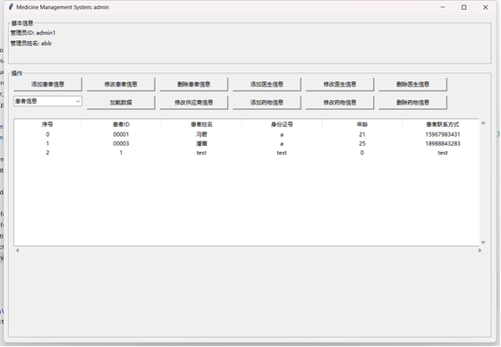

# Medicine-Management-System
NKU-2024-Database System Homework-Medicine Management System

## Project Basic Information
**Project Name:** Medicine Management System  

**Project Essential Environment:** Python 3.12, MySQL 8.0  

**Project Introduction:** This is a large-scale project for designing a hospital based drug management system. It is mainly divided into patient end, doctor end, and administrator end. Firstly, there is a login page where users can choose the corresponding port to log in based on their identity. The patient side can view their own identity information and make modifications to view partial information about the medication; The doctor's end can view doctor information, as well as all patient and medication information, and can also create prescriptions that are recorded in the database; The administrator can view, add, modify, and delete patient, doctor, and medication information.  

**Project screenshot:**  
  
  
  
  
